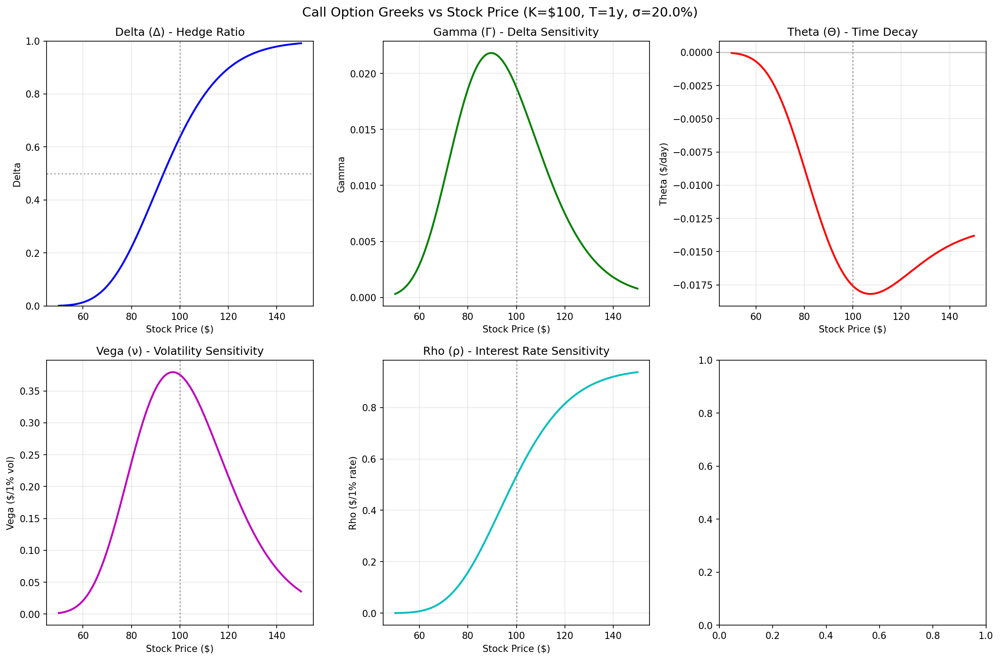
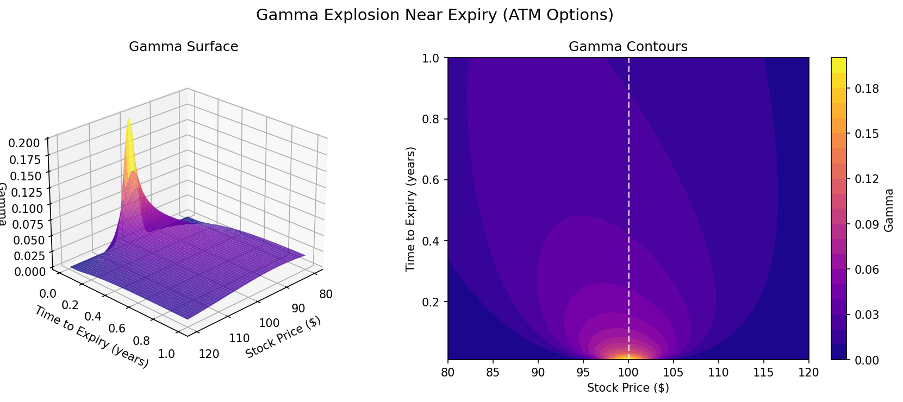
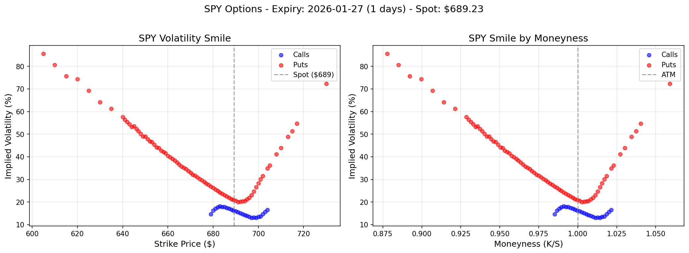
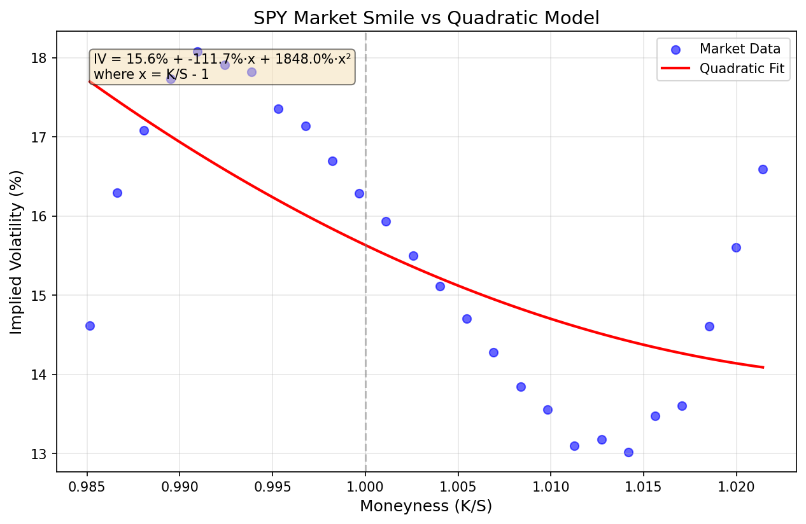
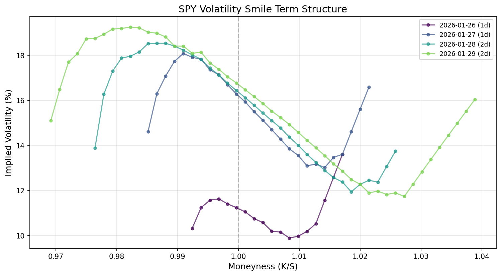

# Option Pricing and Market Risk Analytics

A comprehensive implementation of option pricing models and market risk analytics in Python. This project covers the theoretical foundations and practical implementation of derivatives pricing, from the Black-Scholes model to Value-at-Risk calculations.

## Overview

This project is structured in phases, each building on the previous:

| Phase | Topic | Status |
|-------|-------|--------|
| 1 | Black-Scholes Model & Greeks |  Complete |
| 2 | Implied Volatility & Market Data |  Complete |
| 3 | Monte Carlo Pricing | Complete |
| 4 | Value-at-Risk (VaR) & Expected Shortfall | Complete |

---

## Phase 1: Black-Scholes Model & Greeks

### Mathematical Foundation

The Black-Scholes model prices European options by solving a partial differential equation derived from no-arbitrage principles. The key insight is that an option can be perfectly hedged by continuously adjusting a position in the underlying stock, eliminating the need to estimate expected returns.

**The Black-Scholes PDE:**

```
∂V/∂t + rS(∂V/∂S) + ½σ²S²(∂²V/∂S²) = rV
```

**Solution for a European Call:**

```
C = S·N(d₁) - Ke^(-r(T-t))·N(d₂)
```

where:

```
d₁ = [ln(S/K) + (r + ½σ²)(T-t)] / [σ√(T-t)]
d₂ = d₁ - σ√(T-t)
```

### The Greeks

The Greeks measure option price sensitivity to various parameters:

| Greek | Symbol | Measures Sensitivity To | Formula (Call) |
|-------|--------|------------------------|----------------|
| Delta | Δ | Stock price | N(d₁) |
| Gamma | Γ | Stock price (2nd order) | n(d₁) / [Sσ√T] |
| Theta | Θ | Time decay | -[S·n(d₁)·σ] / [2√T] - rKe^(-rT)N(d₂) |
| Vega | ν | Volatility | S√T·n(d₁) |
| Rho | ρ | Interest rate | KTe^(-rT)N(d₂) |

### Implementation

- `black_scholes.py` — Core pricing functions for European calls and puts
- `greeks.py` — Analytical Greek calculations
- `visualizations.py` — Price and sensitivity visualizations

### Sample Output

```
Black-Scholes Option Pricing
========================================
Stock Price (S):     $100.00
Strike Price (K):    $100.00
Time to Expiry (T):  1 year(s)
Risk-free Rate (r):  5.0%
Volatility (σ):      20.0%
----------------------------------------
Call Price:          $10.4506
Put Price:           $5.5735
```

### Visualizations

#### Option Price vs Stock Price


#### Greeks vs Stock Price


#### Gamma Surface (The "Gamma Explosion")


---

## Phase 2: Implied Volatility & Market Data

### What is Implied Volatility?

Implied volatility (IV) is the volatility that makes the Black-Scholes price match the observed market price. It represents the market's expectation of future volatility.

**The Problem:** Given market price, solve for σ in:

```
C_market = BS(S, K, T, r, σ)
```

There's no closed-form solution — we use numerical methods.

### Newton-Raphson Method

We use Newton-Raphson iteration with vega as the derivative:

```
σ_{n+1} = σ_n - (BS(σ_n) - C_market) / vega(σ_n)
```

Converges in 2-4 iterations typically.

### The Volatility Smile

Black-Scholes assumes constant volatility across all strikes. Reality disagrees.

**What the smile tells us:**
- **OTM puts are expensive** — Investors pay premium for crash protection
- **Negative skew** — Left side (puts) higher than right side (calls)
- **Fat tails** — Market expects more extreme moves than log-normal distribution

### Implementation

- `implied_volatility.py` — Newton-Raphson IV solver with convergence handling
- `market_data.py` — Real market data fetching and analysis using Yahoo Finance

### Real Market Data Analysis

The project fetches live option data and Treasury rates:

```
VOLATILITY SMILE ANALYSIS: SPY
============================================================
Risk-free rate (3m): 3.58% (from Treasury yield)

Market Data:
  Spot Price: $689.23
  Expiry: 2026-01-27
  Days to Expiry: 1

Quadratic fit: IV = 15.6% + -111.7%·x + 1848.0%·x²
  ATM vol: 15.63%
  Skew: -1.1170 (negative = crash protection premium)
  Smile: 18.4796 (curvature)
```

### Visualizations

#### Real Market Volatility Smile (SPY)


The classic equity skew: OTM puts (left) trade at much higher IV than OTM calls (right). This is the price of crash protection.

#### Market Data vs Quadratic Model Fit


A simple quadratic model captures the general shape of the smile, though market microstructure creates scatter.

#### Smile Term Structure


How the smile shape changes across expiration dates. Shorter expiries show more pronounced effects.

---

## Phase 3: Monte Carlo Pricing

### Why Monte Carlo?

Monte Carlo simulation can price any option, including path-dependent options that have no closed-form solution.

| Option Type | Black-Scholes | Monte Carlo |
|-------------|---------------|-------------|
| European call/put | ✓ Exact formula | ✓ Works |
| Asian options (average price) | ✗ No formula | ✓ Works |
| Barrier options (knock-in/out) | Partial | ✓ Works |
| Lookback options | ✗ No formula | ✓ Works |

### The Method

1. Simulate stock price paths using Geometric Brownian Motion
2. Calculate the option payoff for each path
3. Average the payoffs
4. Discount to present value

```
Option Price = e^(-rT) × (1/N) × Σ Payoff_i
```

### Risk-Neutral Valuation

We simulate under the risk-neutral measure where the stock grows at rate r, not μ:

```
S(T) = S(0) × exp[(r - ½σ²)T + σ√T × Z]
```

The (r - ½σ²) term is the Itō correction that ensures correct expected value.

### Implementation

- `monte_carlo.py` — Full Monte Carlo pricing engine with:
  - European options (validated against Black-Scholes)
  - Asian options (arithmetic and geometric average)
  - Barrier options (down-and-out, down-and-in, up-and-out, up-and-in)
  - Lookback options (floating and fixed strike)
  - Antithetic variates for variance reduction
  - Convergence analysis

### Sample Output

```
Monte Carlo Option Pricing
============================================================
Parameters: S0=$100, K=$100, T=1y, r=5.0%, sigma=20.0%

1. EUROPEAN CALL OPTION
Black-Scholes Call Price: $10.4506
Monte Carlo Call Price:   $10.4115 +/- $0.0909 (95% CI)
Error vs BS:              $0.0391

3. ASIAN CALL OPTION (Arithmetic Average)
Monte Carlo Asian Call:   $5.7717 +/- $0.0496
Compared to European:     $-4.6398 (Asian is cheaper)

4. BARRIER CALL OPTION (Down-and-Out, Barrier=$80)
Monte Carlo Barrier Call: $10.3780 +/- $0.0912
Compared to European:     $-0.0335 (Barrier is cheaper)

5. LOOKBACK CALL OPTION (Floating Strike)
Monte Carlo Lookback Call: $16.6759 +/- $0.0911
Compared to European:      $+6.2644 (Lookback is more expensive)
```

### Convergence Analysis

Monte Carlo converges at rate O(1/√N):

```
Paths increased by:    10x (1,000 -> 10,000)
Std Error reduced by:  3.12x
Theoretical reduction: 3.16x (1/sqrt(N) rule)
```

To halve the error, you need 4x more paths.

---

## Phase 4: Value-at-Risk (VaR)

### What is VaR?

VaR answers: "What is the maximum loss over a given time period, at a given confidence level?"

Example: "1-day 95% VaR = $20,000" means there's a 95% probability of not losing more than $20,000 tomorrow.

### Three Methods

| Method | Approach | Pros | Cons |
|--------|----------|------|------|
| Historical | Use actual past returns | No distribution assumption | Limited by history |
| Parametric | Assume normal distribution | Fast, analytical | Underestimates tails |
| Monte Carlo | Simulate scenarios | Flexible | Computationally intensive |

### Expected Shortfall (ES)

ES answers: "If we exceed VaR, how bad is it on average?"

ES is always larger than VaR and captures tail severity. Basel III now requires ES for market risk capital.

### Real Market Results (AAPL)

```
Period: 2024-02-06 to 2026-02-03 (500 days)
Daily volatility: 1.76%

Method                    1-day VaR      10-day VaR
--------------------------------------------------
Historical                  2.70%          8.55%
Parametric                  2.90%          9.18%
Monte Carlo                 2.90%          9.16%

Expected Shortfall: 3.93% (1.45x VaR)
```

### Portfolio VaR

```
Portfolio: AAPL (30%), MSFT (30%), GOOGL (25%), JPM (15%)
Value: $1,000,000

Diversified VaR:        $17,661
Undiversified VaR:      $27,602
Diversification Benefit: $7,064
```

### Backtesting

```
Test period: 250 days
Expected exceedances: 12.5
Actual exceedances: 16
Kupiec p-value: 0.33
Zone: Green ✓
```

### Visualizations

#### Single Stock VaR Analysis


#### Portfolio VaR


#### Backtesting


### Implementation

- `var.py` — Core VaR functions (Historical, Parametric, Monte Carlo, ES, Backtesting)
- `var_market_data.py` — Real market VaR analysis

---
## Installation

```bash
# Clone the repository
git clone https://github.com/YOUR_USERNAME/option_pricing.git
cd option_pricing

# Create virtual environment (recommended)
python -m venv venv
source venv/bin/activate  # On Windows: venv\Scripts\activate

# Install dependencies
pip install -r requirements.txt
```

## Requirements

- Python 3.8+
- NumPy
- SciPy
- Matplotlib
- yfinance (for real market data)
- pandas

## Project Structure

```
option_pricing/
├── README.md
├── requirements.txt
├── phase1_black_scholes/
│   ├── black_scholes.py
│   ├── greeks.py
│   ├── visualizations.py
│   └── images/
├── phase2_implied_volatility/
│   ├── implied_volatility.py
│   ├── market_data.py
│   └── images/
├── phase3_monte_carlo/
│   └── monte_carlo.py
└── phase4_var/
    ├── var.py
    ├── var_market_data.py
    └── images/
```


## Key Concepts Demonstrated

| Concept | Phase | Relevance |
|---------|-------|-----------|
| Risk-Neutral Valuation | 1, 3 | Foundation of derivatives pricing |
| Greeks & Hedging | 1 | Risk management of option positions |
| Implied Volatility | 2 | Market expectations, trading signals |
| Monte Carlo Simulation | 3 | Pricing complex derivatives |
| VaR Calculation | 4 | Regulatory capital, risk limits |
| Expected Shortfall | 4 | Tail risk, Basel III compliance |
| Portfolio Diversification | 4 | Risk reduction through correlation |
| Backtesting | 4 | Model validation |

## References

- Black, F., & Scholes, M. (1973). The Pricing of Options and Corporate Liabilities. *Journal of Political Economy*, 81(3), 637-654.
- Hull, J. C. (2018). *Options, Futures, and Other Derivatives* (10th ed.). Pearson.
- Glasserman, P. (2003). *Monte Carlo Methods in Financial Engineering*. Springer.
- Wilmott, P. (2006). *Paul Wilmott on Quantitative Finance* (2nd ed.). Wiley.

## License

MIT License
## Author

Gabriel Justina Ayomide

---

*This project demonstrates quantitative finance and market risk concepts relevant to roles in trading, risk management, and quantitative analysis.*
